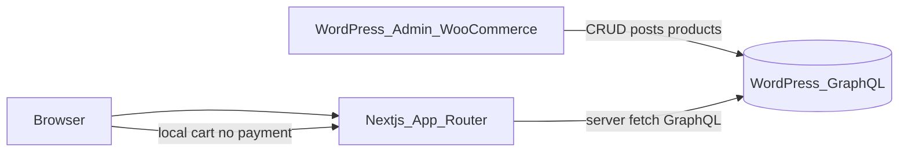

# Plan: Next.js + WordPress GraphQL (MVP)

## Mục tiêu

- Next.js (App Router) là **client/public site**; WordPress admin + WooCommerce giữ nguyên để quản trị nội dung/sản phẩm.
- Site gốc tham chiếu: [hoptacdautu.vn](https://hoptacdautu.vn/).
- MVP: **trang chủ + tin tức + sản phẩm (danh mục đầu tư) + giỏ hàng liên hệ**.
- GraphQL endpoint **chưa có** (`/graphql` hiện 404) — plan chỉ chừa env và adapter; bạn tự cài WPGraphQL + WooGraphQL sau.

## Kiến trúc



- Fetch GraphQL chủ yếu ở **Server Components** (song song `Promise.all`, revalidate theo ISR).
- Giỏ hàng: **client-only** (`localStorage`), không tạo WooCommerce order/checkout.
- “Mua hàng” / checkout: hiển thị **thông tin liên hệ công ty** (hotline, email, Zalo, địa chỉ) — lấy từ env hoặc trang WP `Liên hệ` khi có.

## Cấu hình env (bạn điền sau)

Tạo [`.env.example`](../.env.example) + [`.env.local`](../.env.local) (git-ignore sẵn):

```bash
WORDPRESS_GRAPHQL_URL=https://hoptacdautu.vn/graphql
```

Thông tin thương hiệu / liên hệ nằm trong [`src/config/info.ts`](../src/config/info.ts) (không dùng env).

Phía WP (bạn tự làm sau, không nằm trong scope code Next):

- Cài **WPGraphQL** + **WPGraphQL for WooCommerce (WooGraphQL)**.
- Bật public GraphQL endpoint; cho phép CORS tới domain Next (dev + production).

## Cấu trúc code đề xuất

Trên nền scaffold hiện có ([`package.json`](../package.json), [`src/app`](../src/app)):

```
src/
  app/
    page.tsx                 # Trang chủ
    tin-tuc/page.tsx         # Danh sách tin
    tin-tuc/[slug]/page.tsx  # Chi tiết tin
    san-pham/page.tsx        # Danh sách danh mục đầu tư
    san-pham/[slug]/page.tsx # Chi tiết sản phẩm
    gio-hang/page.tsx        # Giỏ hàng + CTA liên hệ
    layout.tsx               # Shell: header/footer
  components/
    layout/                  # Header, Footer, Nav
    home/                    # Hero, sections tin/sản phẩm
    news/                    # Card, list
    products/                # Card, list, AddToCart
    cart/                    # CartDrawer, ContactCheckout
  lib/
    wordpress/
      client.ts              # graphql fetch helper
      queries.ts             # posts, products, menus (tối thiểu)
      types.ts
    cart/
      store.ts               # cart state (client)
  config/site.ts             # contact + site constants từ env
```

## Data layer (GraphQL)

- Helper mỏng `graphqlRequest<T>(query, variables)` dùng `fetch` tới `WORDPRESS_GRAPHQL_URL`, `next: { revalidate: 60 }` (hoặc tag riêng cho news/products).
- Queries MVP (đặt tên theo schema WPGraphQL/WooGraphQL chuẩn):
  - Posts: list + by slug (title, date, excerpt, content, featuredImage, categories).
  - Products: list + by slug (name, slug, price/raw, shortDescription, description, image, productCategories).
- Khi endpoint chưa sẵn: UI vẫn build được; trang data hiển thị empty/error rõ ràng thay vì crash.
- Ảnh: cấu hình `images.remotePatterns` trong [`next.config.ts`](../next.config.ts) cho `hoptacdautu.vn`.

Áp dụng skill React best practices đã cài: **không waterfall** trên trang chủ (fetch tin + sản phẩm song song), giảm client bundle (chỉ cart/AddToCart là client).

## UI / routes MVP

Bám IA hiện có trên [hoptacdautu.vn](https://hoptacdautu.vn/) nhưng **chỉ ship**:

| Route | Nội dung |
|-------|----------|
| `/` | Hero thương hiệu + tóm tắt dịch vụ (static copy) + tin mới + dự án/sản phẩm mới |
| `/tin-tuc` | Phân trang / load thêm danh sách bài viết |
| `/tin-tuc/[slug]` | Nội dung HTML từ WP (sanitize nhẹ nếu cần) |
| `/san-pham` | Grid danh mục đầu tư (Woo products); lọc theo category nếu schema cho phép |
| `/san-pham/[slug]` | Chi tiết + thêm giỏ + nút “Liên hệ mua” |
| `/gio-hang` | Danh sách local cart; CTA gọi/Zalo/email — **không thanh toán** |

Header/footer: menu tối thiểu (Trang chủ, Tin tức, Sản phẩm, Giỏ hàng) + hotline; các mục WP khác (Về chúng tôi, BĐS con, Tư vấn…) để phase sau dưới dạng link tạm hoặc stub.

Thiết kế: UI Next mới, tone doanh nghiệp đầu tư (không clone pixel theme WP); dùng CSS variables + layout App Router hiện có (Tailwind 4).

## Giỏ hàng (không checkout)

- Client store: add/remove/update qty, persist `localStorage`.
- Không gọi WooCommerce Cart/Checkout API.
- Nút “Mua hàng” / “Hoàn tất”: mở panel/trang với thông tin liên hệ từ `src/config/info.ts` + danh sách sản phẩm đã chọn (để user gửi Zalo/gọi).

## Ngoài MVP (ghi nhận, chưa làm)

- Trang Về chúng tôi, Liên hệ form, Tư vấn, cây menu Đầu tư BĐS / Góc ý tưởng từ WP categories hoặc pages.
- Đăng nhập / tài khoản Woo.
- Thanh toán thật.
- On-demand revalidation webhook từ WP.
- SEO nâng cao (sitemap/JSON-LD) — có thể thêm sớm nếu cần trước launch.

## Thứ tự triển khai

1. Env + GraphQL client + `next.config` images.
2. Layout shell (header/footer/nav).
3. News list + detail.
4. Products list + detail + AddToCart.
5. Cart page + contact CTA.
6. Homepage ghép sections (parallel fetch).
7. Polish empty/error states khi chưa có GraphQL.

## Tiêu chí xong MVP

- Điền `WORDPRESS_GRAPHQL_URL` + plugin WP → tin và sản phẩm hiển thị từ data thật.
- Thêm sản phẩm vào giỏ, mở giỏ, thấy thông tin liên hệ — không có flow thanh toán.
- `yarn dev` / `yarn build` chạy được kể cả khi endpoint chưa sẵn (graceful).
